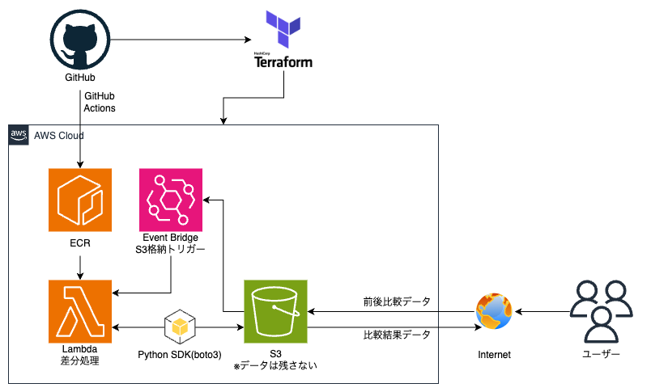

# PDF-difference

## 実行前の確認

- AWS CLI がインストールされている。`~/.aws/credentials`が作成されており、AWS アカウントが登録されている。作成されているフォルダは大抵以下。

```bash
/Users/~/.aws/credentials
```

config は以下のように記述（あくまで一例）。

```bash
[default]
region = ap-northeast-1

[pdf-difference]
region = ap-northeast-1

```

credentials は以下のように記述（あくまで一例）。

```bash
[default]
aws_access_key_id = AKIA~~
aws_secret_access_key = ~~

[pdf-difference]
aws_access_key_id = AKIA~~
aws_secret_access_key = ~~

```

## Step for Deploy AWS

このアプリケーションを AWS にデプロイする方法です。

### Terraform から AWS に ECR をデプロイ

Terraform から AWS にリソースを作成します。
`pdf-difference` という AWS プロファイルから認証情報を読み取っています。
適宜変更してください。

```bash
cd terraform-ecr
terraform init
terraform apply
```

> [!Warning]
> AWS から消す・仕舞う・片付けることがしたい場合は
> 以下のコマンドを利用。
> `terraform destroy`

### GitHub Actions で ECR に Docker image をプッシュ

GitHub にログインし、Actions から build.yml を実行する。
SECRET_ACCESS_TOKEN の設定は以下を参考。

https://dev.classmethod.jp/articles/github-personal-access-tokens/

### Terraform から AWS に Lambda/S3 をデプロイ ECR からプッシュ

Terraform から AWS にリソースを作成します。
`pdf-difference` という AWS プロファイルから認証情報を読み取っています。
適宜変更してください。

```bash
cd terraform
terraform init
terraform apply
```

> [!Warning]
> AWS から消す・仕舞う・片付けることがしたい場合は
> 以下のコマンドを利用。
> `terraform destroy`

### ECR を更新した際の Lambda にプッシュする方法

ターミナルにて以下を実行。

```bash
aws lambda update-function-code --function-name pdf-difference-lambda-function --image-uri ************.dkr.ecr.ap-northeast-1.amazonaws.com/pdf-difference-lambda-python:latest
```

## Step for Develop Application

ローカル環境で Python を動かす方法です。

### Docker

Docker を起動し、curl を叩く。

```bash
cd application
docker-compose up -d
curl -XPOST "http://localhost:9000/2015-03-31/functions/function/invocations" -d '{}'
```

終了の場合以下。

```bash
docker-compose down --volumes
```

プログラムの更新を行なった場合は、Docker images から削除する必要もある。

## How to Usage

### フロー概略

1. before、after の順で PDF を S3 に保存するようにする
2. PDF はひとつずつ入れるようにする
3. (今後対応) S3 に入れるフローを作る
4. (今後対応) Lambda 起動中は S3 に入れられないようにする

### 注意点

- PDF ファイル名に「before」「after」を入れないこと
- 「利用中のため使用禁止」のフォルダがあるときは作業しないこと
- 「利用中のため使用禁止」のフォルダの時刻が 6 分以上経っても残っている場合は不具合が発生している
- 2 分以内にファイルをダウンロードすること

## システム構成図



## IAM ユーザーの発行

pdf-difference-bucket のみにアクセスできる IAM ユーザーを AWS コンソールから発行する。

- IAM ポリシーを作成(最初のみ)。
  ポリシー名は「pdf-difference-bucket-access」

```bash
{
    "Version": "2012-10-17",
    "Statement": [
        {
            "Effect": "Allow",
            "Action": "s3:ListAllMyBuckets",
            "Resource": "arn:aws:s3:::*"
        },
        {
            "Effect": "Allow",
            "Action": "s3:*",
            "Resource": [
                "arn:aws:s3:::pdf-difference-bucket",
                "arn:aws:s3:::pdf-difference-bucket/*"
            ]
        }
    ]
}
```

- ユーザーグループを作成(管理しやすいように)。
  先ほど作ったポリシーを入れて、グループ名は「pdf-difference-users」

- ユーザーを作成し、先ほどで作ったユーザーグループをアタッチする。
  　一応の命名規則として、pdf.の接頭辞を入れている。

- csv をダウンロードし、利用者に渡す。
